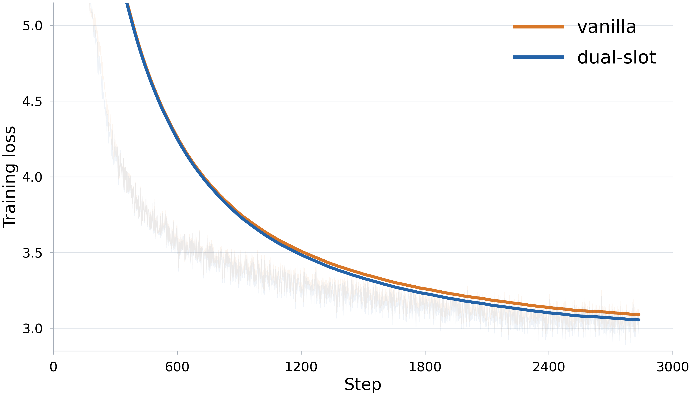

# Dual Slot

**From Serial Loops to Parallel Slots in Language Models.**

Dual Slot reuses a shared Transformer core through parallel latent and prediction slots. This repository implements the Qwen3 architecture on [NVIDIA Megatron-LM](https://github.com/NVIDIA/Megatron-LM), with Transformer Engine and FlashAttention.

[Paper](docs/paper.pdf) · [Training configuration](configs/70m.sh) · [Results](results)

## Results



70M models trained for 1.487B tokens (TPP20), with the same parameters, data order and optimizer settings. Curves show training loss with exponential smoothing (0.997).

| Model | Parameters | Validation loss | Perplexity |
| --- | ---: | ---: | ---: |
| vanilla | 74,325,248 | 3.0744 | 21.6361 |
| dual-slot | 74,325,248 | **3.0378** | **20.8599** |

Raw training and validation metrics are in [results/](results). Render the figure with `python scripts/plot_results.py` after installing `requirements-plot.txt`; PNG, SVG and PDF are included in [assets/](assets).

## Method

Split the Transformer into prefix, core and suffix. The prefix produces fixed representations $X$, and a warm core pass initializes latent states $L^{(0)}=F(X)$. Each parallel round computes

$$
\left(L^{(k)},Y^{(k)}\right)
=\operatorname{Unzip}\!\left[
F\!\left(\operatorname{Interleave}\!\left(X,\,X+\operatorname{ShiftPrev}(L^{(k-1)})\right)\right)
\right].
$$

Latent and prediction slots share token positions and use latent-first causal ordering. Only latent outputs provide feedback to the next round; the suffix and language-model head consume the final prediction states $Y^{(K)}$. The core shares parameters across the warm pass and all rounds, with gradients through the complete computation. Training samples $K\in\{2,3\}$; evaluation uses $K=3$.

## Setup

Use Linux, Python 3.12, a BF16-capable NVIDIA GPU and CUDA 12.4.

```bash
git clone --recurse-submodules https://github.com/ZitongWang018/dual-slot.git
cd dual-slot
export CUDA_HOME=/path/to/cuda
bash scripts/install.sh
source scripts/native_env.sh
```

Megatron-LM is pinned to `core_v0.13.0` (`c550cf6c`). The installer builds Apex CUDA extensions and installs PyTorch 2.6.0, Transformer Engine 2.13.0 and FlashAttention 2.7.4.post1. Set `DUAL_SLOT_DATA_ROOT` before setup to choose the environment, cache and output directory; its default is `~/.local/share/dual-slot`.

## Train

Supply Megatron indexed datasets with matching `.bin` and `.idx` files. Dataset paths omit these extensions. Use token IDs matching the 50,304-entry vocabulary and set your tokenizer's EOD ID.

```bash
export TRAIN_DATA=/path/to/data/train
export VALID_DATA=/path/to/data/valid
export EOD_ID=0
export RUN_ID=70m-tpp20-seed42

GPUS=8 bash scripts/train.sh vanilla
GPUS=8 bash scripts/train.sh dual-slot
```

The 70M recipe follows [P2N](https://github.com/hyq718/p2n) (`dd08fc2b`). Vanilla and Dual Slot use the same physical layers and native Megatron dataset, optimizer, scheduler and checkpoint pipeline.

| Setting | Value |
| --- | --- |
| Layers / hidden / FFN | 6 / 512 / 2048 |
| Attention | GQA; 8 query heads, 2 KV heads, head dimension 64 |
| Embeddings | Untied |
| Normalization / activation | RMSNorm, Q/K normalization / SwiGLU |
| Positions | RoPE, base 1e6 |
| Shared core | Layers 3–4 |
| Context / global batch / microbatch | 2048 / 256 / 4 |
| GPUs / accumulation | 8 / 8 |
| Precision / backend | BF16 / Transformer Engine + FlashAttention |
| Optimizer | AdamW; betas 0.9/0.95, epsilon 1e-8 |
| LR / schedule | 1.5e-3 to 1.5e-4 / cosine |
| Warmup / weight decay / clip | 142 steps / 0.1 / 1.0 |
| Steps / tokens / seed | 2836 / 1,486,848,768 / 42 |

Additional Megatron arguments override launcher defaults. Outputs are separated by run and method. Relaunching a run restores its latest checkpoint; `RESUME_CHECKPOINT` selects an explicit checkpoint directory.

### Slurm

```bash
PARTITION=your_gpu_partition bash scripts/submit_pair.sh
```

This submits the eight-GPU implementation checks, then Vanilla followed by Dual Slot. The templates request one node with eight GPUs; adjust CPU, memory and time limits for your system.

### Tracking

TensorBoard logs are saved with each checkpoint directory. To enable SwanLab:

```bash
export SWANLAB=1
export SWANLAB_API_KEY=your_api_key
export SWANLAB_WORKSPACE=your_workspace
export SWANLAB_PROJECT=dual-slot
```

## Evaluate

```bash
GPUS=8 bash scripts/evaluate.sh vanilla /path/to/vanilla-checkpoint
GPUS=8 bash scripts/evaluate.sh dual-slot /path/to/dual-slot-checkpoint
```

Evaluation reads `VALID_DATA`; Dual Slot uses three parallel rounds.

## Tests

```bash
"$PYTHON" -m pytest -q tests/test_dual_slot_native.py
"$PYTHON" scripts/check_native_gpu.py
sbatch --partition=your_gpu_partition scripts/native_smoke.sbatch
```

The checks cover paired recurrence, complete gradients, causal ordering, FlashAttention kernels, optimizer groups, eight-GPU updates and checkpoint continuation.

## License

[Apache 2.0](LICENSE). Megatron-LM retains its original license and notices in `vendor/Megatron-LM`.
